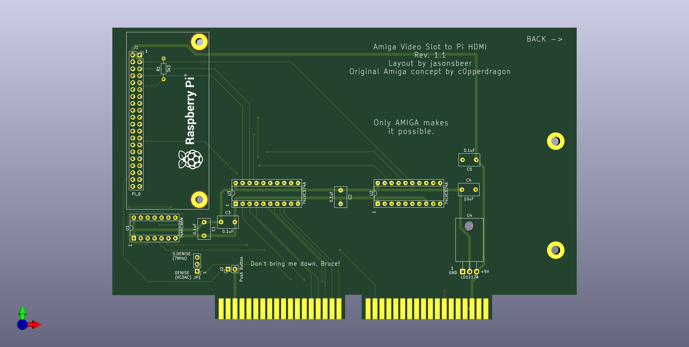

# Amiga Video Slot to HDMI with Through Hole Components
This project was inspired by the [Amiga Digital Video](https://github.com/c0pperdragon/Amiga-Digital-Video) project by c0pperdragon. This design makes use of the Amiga 2000/3000 video slot. This project makes use of easy to solder through hole components, making it friendly for even the novice DIYer. At the time of writing this, all the components are currently available through DigiKey.
There are mounting holes to facilitate the use of a support bracket, which could be 3D printed. This bracket could include a mounting position for an HDMI panel mount socket and a momentary switch for use with the card. If anyone wants to design and share a bracket, that would be very helpful.

## PCB Ordering
The gerber files are available in the [Gerber](/Gerber) folder. Download the file and send to your preferred PCB manufacturer. I've been ordering mine through PLCPCB and am very happy. Most of the options will be set directly from the Gerber file. For the rest, you can select these [options](JLCPCB.png).

## PCB Assembly
Order parts from the BOM list. I have included DigiKey part numbers for reference. Solder the components to the board, noting orientation of the sockets. You can solder the chips directly to the board, but I do not recommend this for DIY projects.

### BOM
|Component|Package|Location|QTY|Source|Part Number|
--- | --- | --- | --- | --- | ---
SN74AHC86|14-DIP|U1|1|DigiKey|296-4627-5-ND
SN74AHC574|20-DIP|U2-3|2|DigiKey|296-4616-5-ND
LD1117AV33|TO-220-3|U4|1|DigiKey|497-1485-5-ND
14-DIP Socket|14-DIP|U1,4|2|DigiKey|AE9989-ND
20-DIP Socket|20-DIP|U2-3|2|DigiKey|AE9998-ND
SN74HC266|14-DIP|U5|1|DigiKey|296-8294-5-ND
0.1uF Ceramic Capacitor|Radial|C1-3,5|4|DigiKey|399-14065-1-ND
10uF Ceramic Capacitor|Radial|C4|1|DigiKey|445-181284-1-ND
40 Position Female Header|-|J1|1|DigiKey|S6104-ND
3x1 Male Header|-|JP1|1|DigiKey|732-5316-ND
Jumper|-|JP1|1|DigiKey|609-6251-ND
2x1 Male Header|-|J2|1|DigiKey|732-5315-ND
3.3k Resistor|Axial|R1|1|DigiKey|3.3KQBK-ND
1k Resistor|Axial|R2|1|DigiKey|1.0KQBK-ND
Panel Mount HDMI Cable (optional)|-|-|1|DigiKey|1528-1575-ND
HDMI Mini to HDMI Adapter (optional)|-|-|1|DigiKey|1528-2481-ND

## Using The Card
You will need to supply a Raspberri Pi Zero and copy the correct program to a micro-SD card for the Pi to run. The standard (non-W) version works fine and is cheaper. You can obtain the current software release from the [RGBtoHDMI](https://github.com/hoglet67/RGBtoHDMI/releases) project page. Click on the link of the newest release, scroll to the bottom of the page, and download the zip file. Copy the files to the micro SD card and install the micro SD card on the Pi Zero. Attach the Pi Zero to the video card, making sure to double check the orientation. The Pi Zero should be installed "face down", with pin 1 towards the "top" of the card. Installing the Pi incorrectly will likely kill it.

Set JP1 to match the Denise version in your Amiga. S.Denise = Super Denise (CSG 8373) or Denise (MOS 8362). An incorrect jumper setting will result in a low quality image. Connect an HDMI cable to the Raspberri Pi and to an HDMI or DVI monitor. If you do not have a support bracket, I strongly encourage you to place a peice of thin cardboard between the video card and the power supply of the Amiga 2000. Tape it in place to ensure the card will not short out on the power supply housing.

## Revision History
March 3, 2021 - Initial production release
