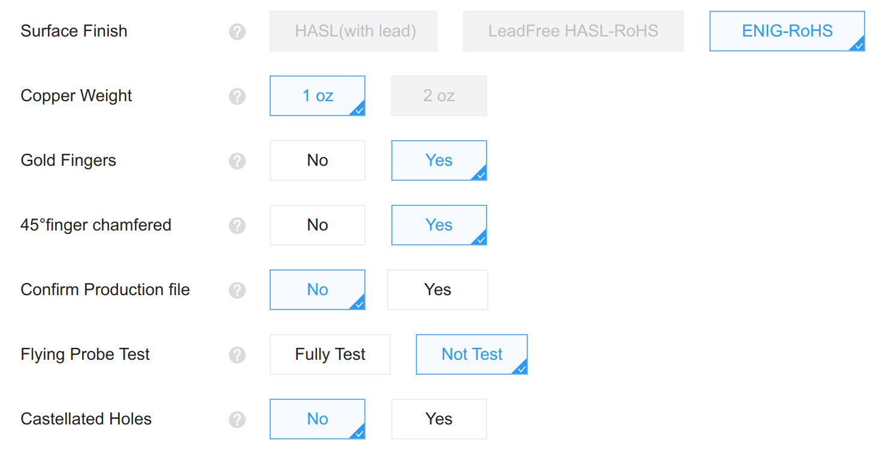

# Amiga Video Slot to HDMI with Through Hole Components
This project was inspired by the [Amiga Digital Video](https://github.com/c0pperdragon/Amiga-Digital-Video) project by c0pperdragon. This design makes use of the Amiga 2000/3000 video slot. I beleive in simplicity. This project installs in the Amiga video slot and makes use of easy to solder through hole components, making it friendly to even the novice DIYer.

## PCB Ordering and Assembly
The gerber files are available in the [Gerber](/Gerber) folder. Download the file and send to your preferred PCB manufacturer. I've been ordering mine through PLCPCB and am very happy. Most of the options will be set directly from the Gerber file. For the rest, you can select these options.

