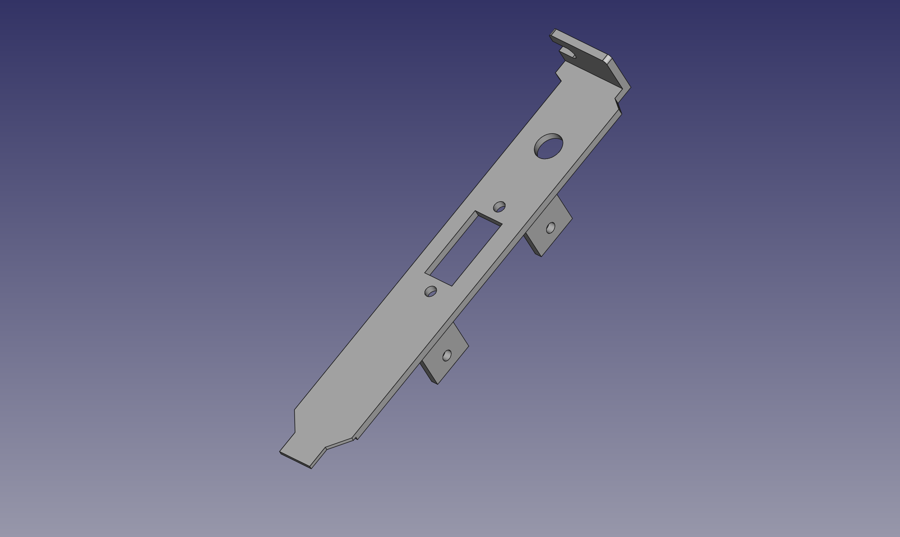

These are the STL and FreeCAD files used to print a bracket in order to use this card in the Amiga 2000 EATX (https://github.com/jasonsbeer/Amiga-2000-ATX). It includes a mounting for a momentary pushbutton switch (7.2mm cutout) and HDMI panel mount socket.

